# Jam Wallet Guidance Report

## Scope
This report documents the contextual wallet guidance implementation for Jam, including state-aware guidance on the home screen, a dynamic cheatsheet flow, and test coverage for the journey state logic.

## Implementation Summary
The feature was implemented as a frontend-only change with no backend or schema updates.

- Added a typed journey hook that derives wallet journey state from existing contexts.
- Added a contextual `JourneyCard` that maps each state to a title, description, icon, and CTA.
- Refactored `Cheatsheet` progress behavior so current/completed/upcoming steps react to state and persisted progress.
- Added tests for state transitions and component behavior.
- Removed inline code comments from the modified journey-related files for a clean submission.

## Code Changes
Primary files to review:

- `src/hooks/useWalletJourneyState.ts`
- `src/hooks/useWalletJourneyState.test.ts`
- `src/components/ui/jam/JourneyCard.tsx`
- `src/components/ui/jam/JourneyCard.test.tsx`
- `src/hooks/useCheatsheetSteps.ts`
- `src/hooks/useCheatsheetSteps.test.ts`
- `src/components/ui/jam/Cheatsheet.tsx`
- `src/components/MainWalletPage.tsx`
- `src/components/MainWalletPage.test.tsx`
- `src/components/layout/Layout.tsx`
- `src/i18n/locales/en/translation.json`
- `src/index.css`

## Journey State Model
The journey layer resolves one of these states:

- `loading`
- `no-wallet`
- `service-offline`
- `empty-wallet`
- `awaiting-confirmation`
- `action-required`
- `ready`

These states are used consistently across:

- `data-journey-state` attribute on `MainWalletPage`
- contextual `JourneyCard` rendering
- cheatsheet current/completed step highlighting

## Reviewer Validation Notes
Manual run validated against regtest flow:

1. Fresh wallet starts at funding guidance.
2. Deposits move into waiting/confirmation guidance.
3. Confirmed funds surface ready-to-send guidance.
4. Cheatsheet progresses through send, bond, maker, and sweep journey steps.
5. Progress and dismiss behavior persist via `localStorage`.

## Screenshot Evidence
All evidence assets are in:

- `docs/assets/jam-wallet-guidance/`

Screenshots used in report order:

1. Empty wallet guidance card  
`docs/assets/jam-wallet-guidance/01-empty-wallet-guidance.png`

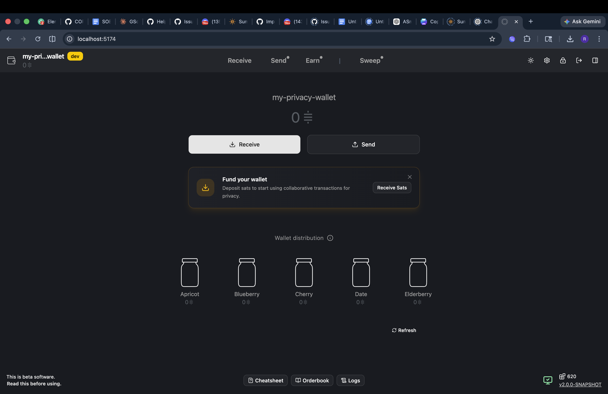

2. Cheatsheet step 1 highlighted  
`docs/assets/jam-wallet-guidance/02-cheatsheet-step-1.png`

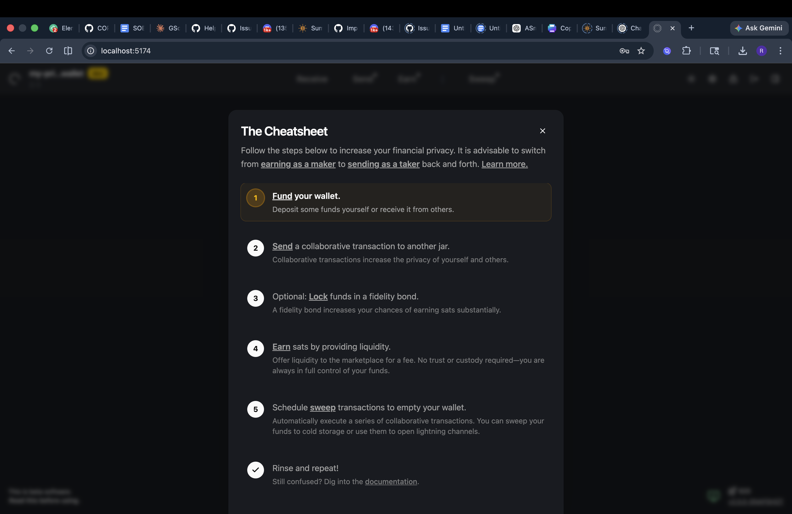

3. Cheatsheet step 2 highlighted  
`docs/assets/jam-wallet-guidance/03-cheatsheet-step-2.png`

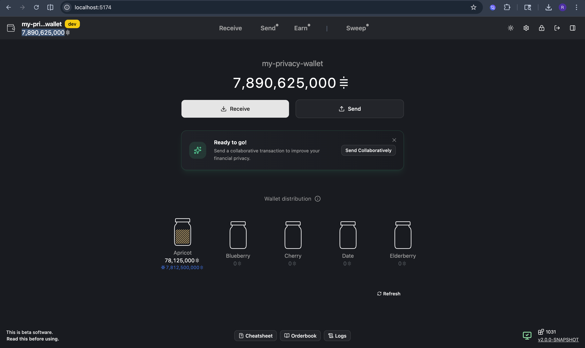

4. Optional fidelity bond step highlighted  
`docs/assets/jam-wallet-guidance/04-cheatsheet-step-3-optional-bond.png`

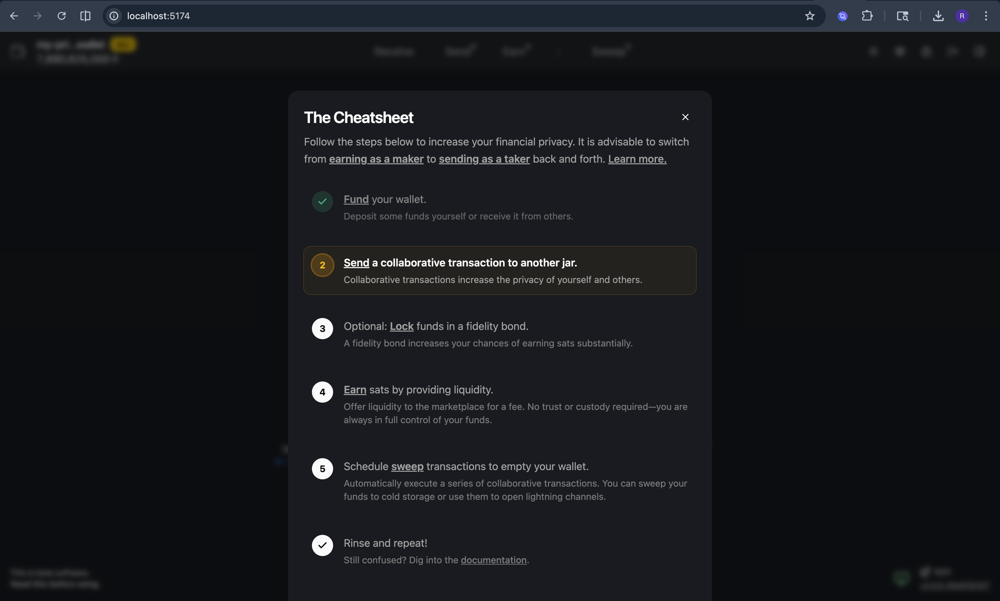

5. Fidelity bond created confirmation  
`docs/assets/jam-wallet-guidance/05-fidelity-bond-created.png`

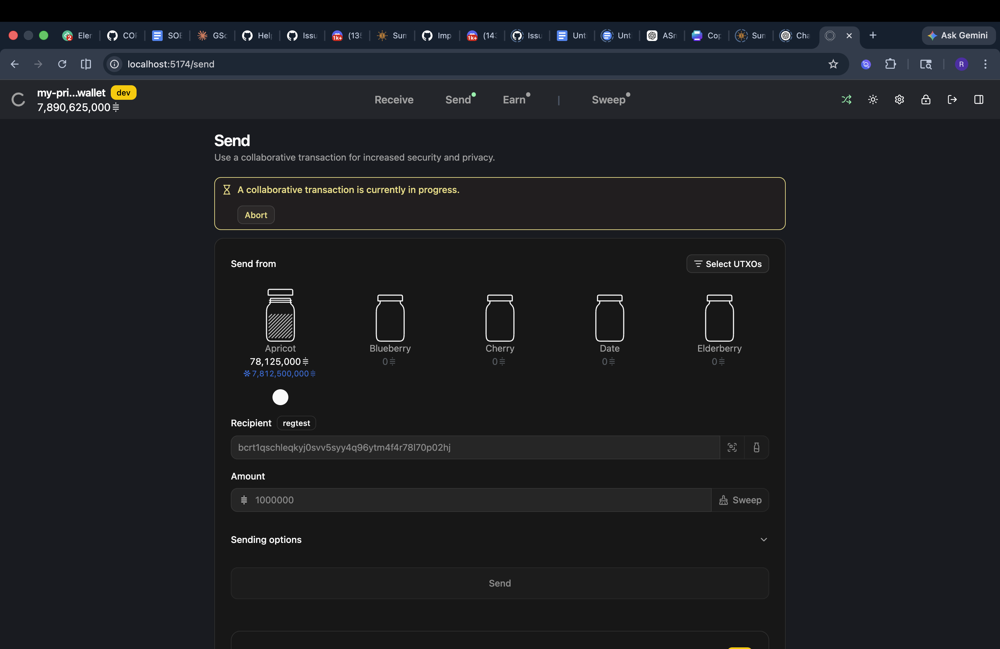

6. Ready state card (variant A)  
`docs/assets/jam-wallet-guidance/06-ready-state-card-a.png`

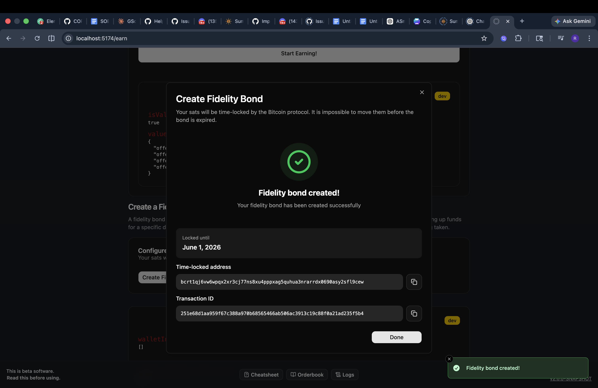

7. Ready state card (variant B)  
`docs/assets/jam-wallet-guidance/06-ready-state-card-b.png`

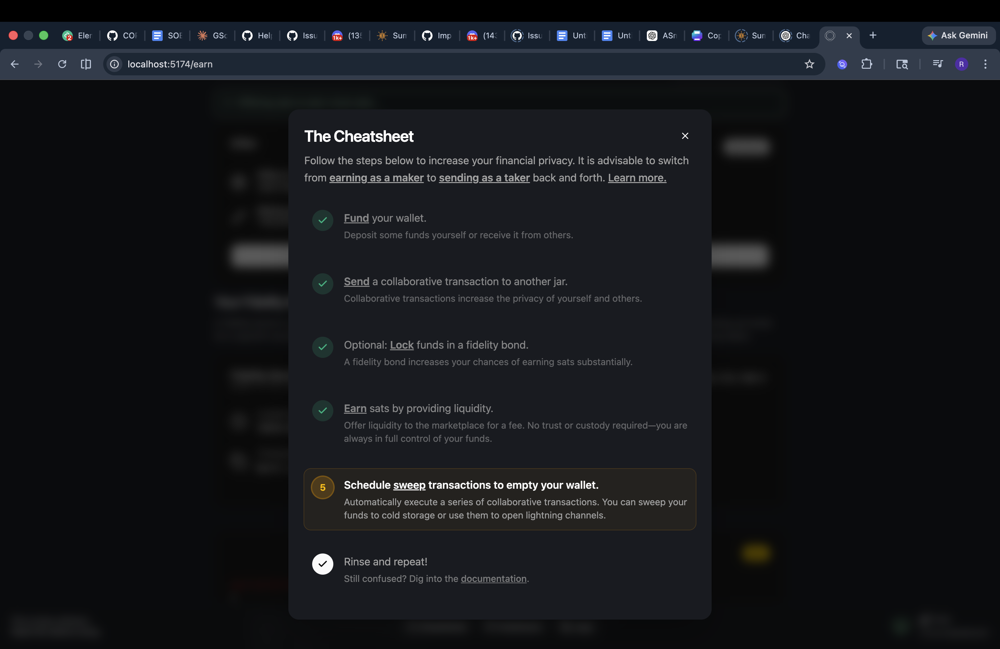

8. Collaborative transaction in progress  
`docs/assets/jam-wallet-guidance/07-send-in-progress.png`

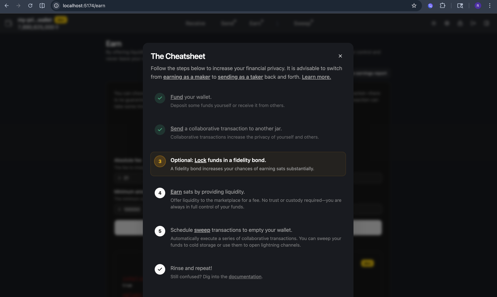

9. Cheatsheet step 5 highlighted  
`docs/assets/jam-wallet-guidance/08-cheatsheet-step-5.png`

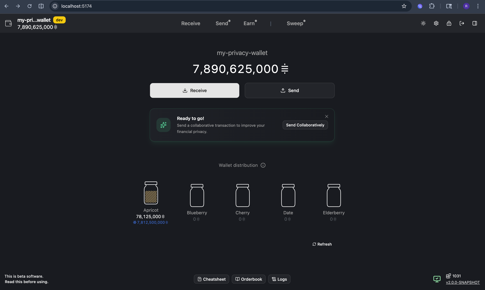

10. Scheduled sweep in progress  
`docs/assets/jam-wallet-guidance/09-scheduled-sweep.png`

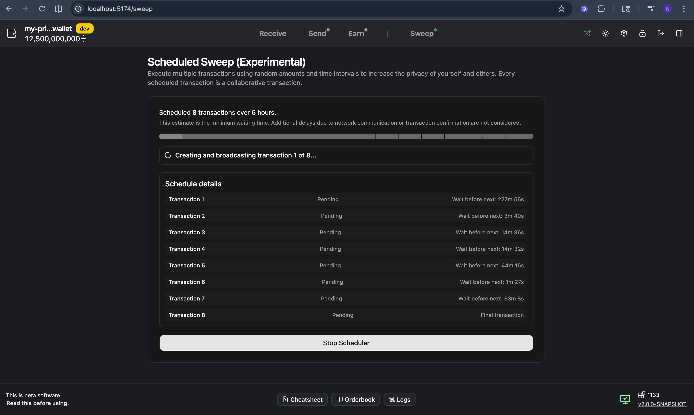

11. Final cheatsheet completion state  
`docs/assets/jam-wallet-guidance/10-cheatsheet-complete.png`

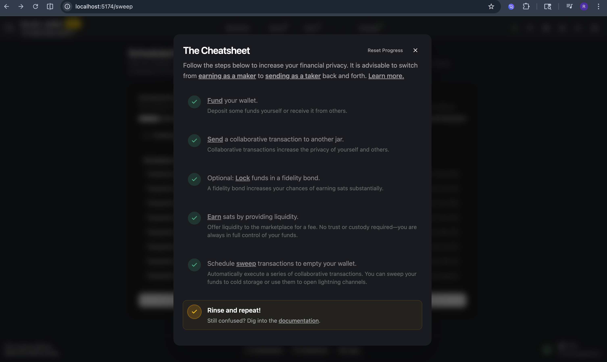

## Security Note
One screenshot showing seed phrase and password confirmation was intentionally excluded from this report and from uploaded assets to avoid publishing sensitive wallet information patterns.
